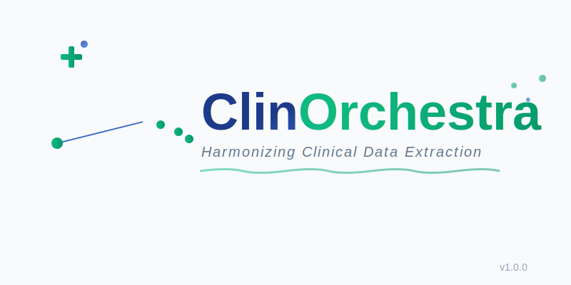
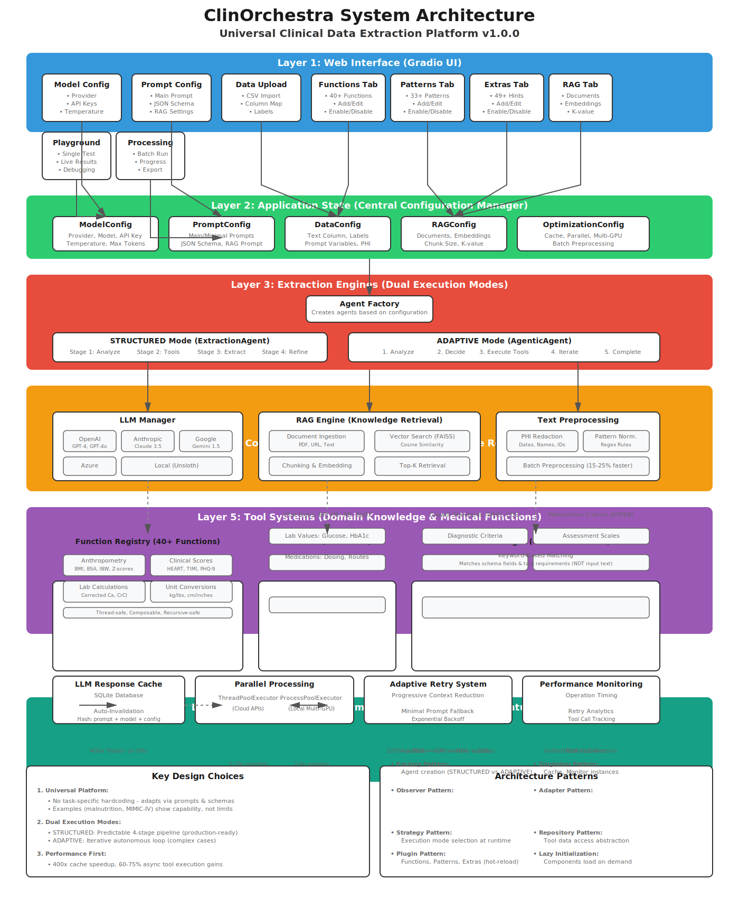
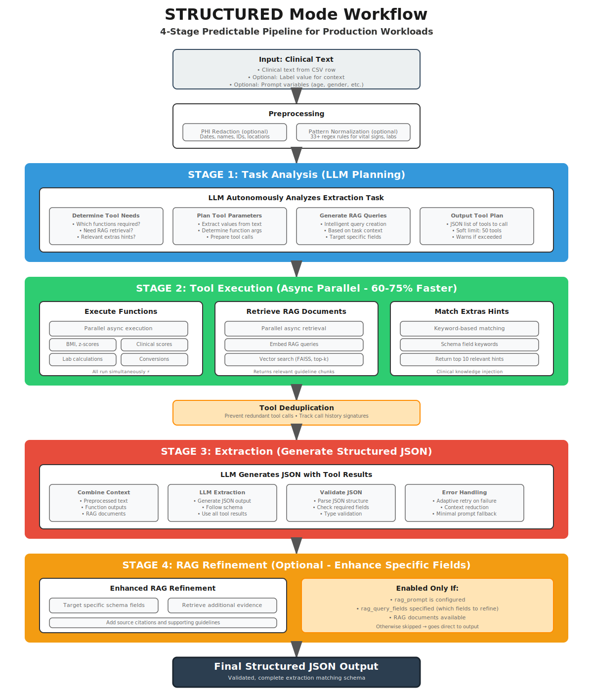
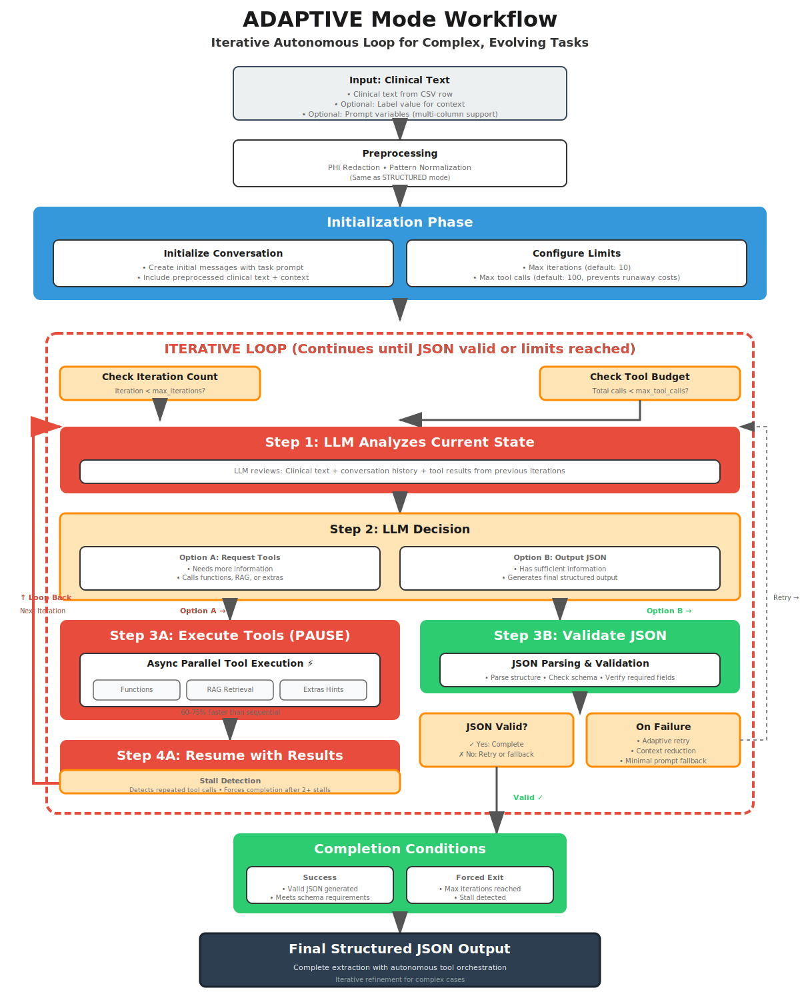

# ClinOrchestra v1.0.0

**Universal LLM-Powered Clinical Data Extraction Platform**

ClinOrchestra is a **universal** intelligent system for extracting structured information from ANY clinical data using large language models (LLMs), retrieval-augmented generation (RAG), custom functions, and domain knowledge. While examples include malnutrition classification and MIMIC-IV diagnosis annotation, the platform adapts to **any clinical extraction task** through customizable prompts and schemas.



---

## Key Features

- **🌐 Universal Platform**: Adapts to ANY clinical extraction task via prompts and JSON schemas
  - No hardcoded task logic - completely configurable
  - Examples provided (malnutrition, MIMIC-IV) demonstrate capability, not limits
- **⚙️ Dual Execution Modes**:
  - **STRUCTURED**: Reliable 4-stage pipeline for production workloads
  - **ADAPTIVE**: Autonomous iterative loop with parallel tool execution for complex cases
- **🔧 Multi-Column Prompt Variables**: Pass multiple dataset columns as prompt placeholders
  - Configure which columns feed into prompts (e.g., patient_id, age, gender, diagnosis)
  - Full backward compatibility with simple text-only workflows
- **📚 RAG Integration**: Retrieve clinical guidelines from PDFs and URLs during extraction
- **🧮 Custom Functions**: Create and use medical calculations (BMI, scores, conversions)
- **💡 Clinical Knowledge**: Pre-load domain expertise (WHO standards, diagnostic criteria)
- **🔤 Pattern Normalization**: Standardize clinical abbreviations and formats automatically
- **🤖 Multi-LLM Support**: OpenAI, Anthropic, Google, Azure, Unsloth (local models)
- **⚡ High Performance**: Parallel processing, caching, async tool execution (60-75% faster)
- **🚀 Multi-GPU Processing**: Automatic multi-GPU support for local models (2-4x faster on H100 clusters)
- **🖥️ Web Interface**: User-friendly Gradio UI with real-time progress tracking

---

## Installation

```bash
# From PyPI
pip install clinorchestra

# With local LLM support
pip install clinorchestra[local]

# From source
git clone https://github.com/gyasifred/clinorchestra.git
cd clinorchestra
pip install -e .
```

---

## Quick Start

```bash
# Launch application
clinorchestra
```

Web interface opens at `http://localhost:7860`

### Basic Workflow

1. **Model Setup**: Select LLM provider and configure API key
2. **Define Task**: Write extraction prompt and JSON schema
3. **Upload Data**: Load CSV file with clinical text
4. **Configure Tools**: Enable patterns, functions, extras, RAG documents
5. **Test**: Use Playground to test single extraction
6. **Process**: Batch process entire dataset

---

## System Architecture

ClinOrchestra features a **6-layer modular architecture** designed for scalability, flexibility, and production-ready performance.

### Architecture Overview



**The 6 Layers:**
1. **Web Interface** - Gradio-based UI with configuration tabs
2. **Application State** - Central configuration manager (Observer pattern)
3. **Extraction Engines** - Dual execution modes (STRUCTURED & ADAPTIVE)
4. **Core Services** - LLM integration, RAG engine, preprocessing
5. **Tool Systems** - Functions, patterns, extras for domain knowledge
6. **Optimization** - Caching (400x faster), parallel processing, adaptive retry

**For detailed architecture documentation, see [ARCHITECTURE.md](ARCHITECTURE.md)**

---

## Execution Modes

### STRUCTURED Mode (Default)

Systematic 4-stage pipeline for reliable, production-ready extraction:



```
Stage 1: Task Analysis → Determine required tools
Stage 2: Tool Execution → Run functions, RAG, extras (async/parallel)
Stage 3: Extraction → Generate structured JSON output
Stage 4: RAG Refinement → Enhance selected fields (optional)
```

**Best for**: Predictable workflows, production deployments, maximum reliability

### ADAPTIVE Mode

Autonomous iterative loop for complex extractions:



```
Continuous Loop:
1. LLM analyzes clinical text
2. Decides which tools to call
3. Executes tools in parallel (async)
4. Analyzes results
5. Iterates until extraction complete
6. Outputs final JSON
```

**Best for**: Evolving requirements, complex cases, maximum flexibility

Enable ADAPTIVE mode in the Config tab with max iterations and tool call limits.

### Component Interactions


See how all components work together seamlessly through the Observer pattern, with AppState managing configuration and agents orchestrating LLM + Tools + RAG.

---

## Example

**JSON Schema:**
```json
{
  "diagnosis": {"type": "string", "required": true},
  "severity": {"type": "string"},
  "medications": {"type": "array"}
}
```

**Clinical Text:**
```
Patient presents with Type 2 DM, HbA1c 8.2%.
BP 145/92. Current meds: Metformin 1000mg BID.
```

**Output:**
```json
{
  "diagnosis": "Type 2 Diabetes Mellitus",
  "severity": "Uncontrolled (HbA1c 8.2%)",
  "medications": ["Metformin 1000mg twice daily"],
  "blood_pressure": "145/92 mmHg - Stage 2 Hypertension"
}
```

---

## Core Components

### Functions (20+ medical calculations)
- BMI, BSA, IBW calculations
- Growth percentiles and z-scores
- Lab value corrections (calcium, anion gap)
- Unit conversions (kg/lbs, cm/inches)
- Clinical scores (MAP, CrCl, HEART, TIMI, CAGE, NIHSS, KDIGO, GOLD)

### Patterns (33+ text normalizations)
- Vital signs: BP, HR, RR, temperature, SpO2
- Lab values: glucose, HbA1c, electrolytes
- Medications: dosing, frequency, routes
- Diagnosis abbreviations: DM→diabetes mellitus

### Extras (49+ clinical hints)
- Growth standards (WHO, CDC)
- Malnutrition criteria (ASPEN)
- Diagnostic criteria (diabetes, hypertension, sepsis)
- Assessment scales (APGAR, Glasgow, NYHA)
- Reference ranges and clinical norms

### RAG (Knowledge retrieval)
- Upload clinical guidelines (PDF/URL)
- Automatic chunking and embedding
- Similarity search during extraction
- Source citation in outputs

---

## Advanced Features

- **PHI Redaction**: Detect and redact protected health information
- **Multi-format Output**: Save redacted/normalized text alongside extractions
- **Error Handling**: Configurable retry strategies with intelligent fallback
- **Progress Tracking**: Real-time batch processing status
- **Configuration Persistence**: Auto-save all settings
- **Performance Monitoring**: Track extraction timing metrics
- **Prompt Variables**: Pass any dataset columns as template variables

---

## Use Cases (Platform is Universal - Not Limited to These)

The platform is **universal** and adapts to any clinical extraction task. Examples include:

- **Clinical Data Curation**: Create annotated datasets for AI/ML training
- **Chart Review**: Extract structured information from large medical record sets
- **Quality Improvement**: Measure guideline adherence across patient populations
- **Research Data Extraction**: Extract research variables from clinical narratives
- **Decision Support**: Extract parameters for clinical decision support systems
- **Diagnosis Annotation**: Comprehensive evidence extraction for medical AI training
- **Multiclass Classification**: Probabilistic diagnostic predictions with reasoning
- **Nutritional Assessment**: Extract malnutrition indicators and growth metrics
- **Clinical Trial Screening**: Extract eligibility criteria from patient charts
- **Adverse Event Detection**: Identify and categorize adverse events from notes

**The only limit is your prompt and schema design** - ClinOrchestra provides the universal infrastructure.

---

## Documentation

### Core Documentation
- **`SDK_GUIDE.md`**: **Comprehensive guide for programmatic usage (Python SDK)**
- `ARCHITECTURE.md`: System design and component overview
- `MULTI_GPU_GUIDE.md`: Multi-GPU processing for local models (H100 clusters)
- `README.md`: This file (quick start and overview)

### SDK vs UI Usage

**🖥️ Web UI** (Default): Launch with `clinorchestra` command - best for interactive exploration and testing

**🐍 Python SDK**: Import and use programmatically - best for:
- Integration into data pipelines
- Batch processing automation
- Custom applications
- Reproducible research workflows

**→ See [`SDK_GUIDE.md`](SDK_GUIDE.md) for complete programmatic usage examples**

### Examples (Demonstrating Universal Capability)
- `examples/malnutrition_classification/`: Malnutrition assessment example
- `examples/`: Additional sample datasets and use cases
- `mimic-iv/`: MIMIC-IV diagnosis annotation example (comprehensive clinical AI training)

### Evaluation
- `evaluation/`: Benchmarking and testing tools

---

## Contributing

Contributions welcome! Please:
1. Fork the repository
2. Create a feature branch
3. Add tests for new functionality
4. Submit a pull request

---

## License

MIT License

---

## Contact

- **GitHub**: https://github.com/gyasifred/clinorchestra
- **Email**: gyasi@musc.edu
- **Institution**: Medical University of South Carolina, Biomedical Informatics Center

---

## Acknowledgments

- HeiderLab, ClinicalNLP Lab, MUSC
- CDC (growth chart data)
- Clinical guideline organizations (WHO, ASPEN, ADA, ACC/AHA)

---

**Version**: 1.0.0 (Production Release)
**Platform Type**: Universal Clinical Data Extraction System
**Author**: Frederick Gyasi
